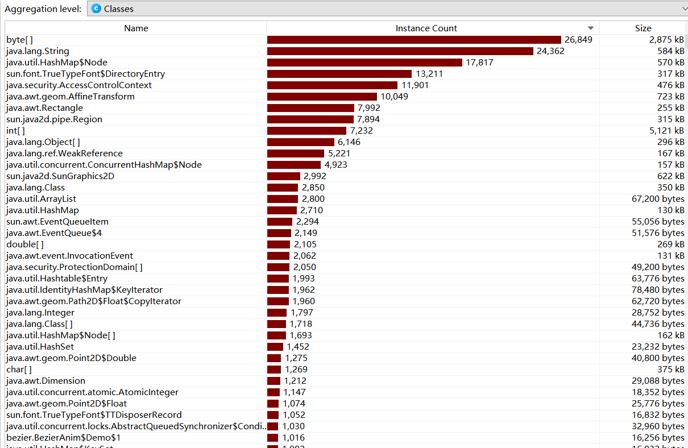
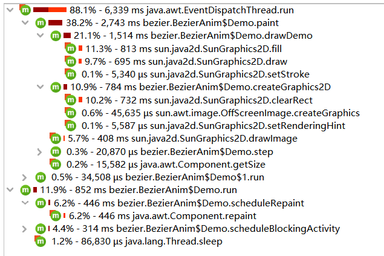
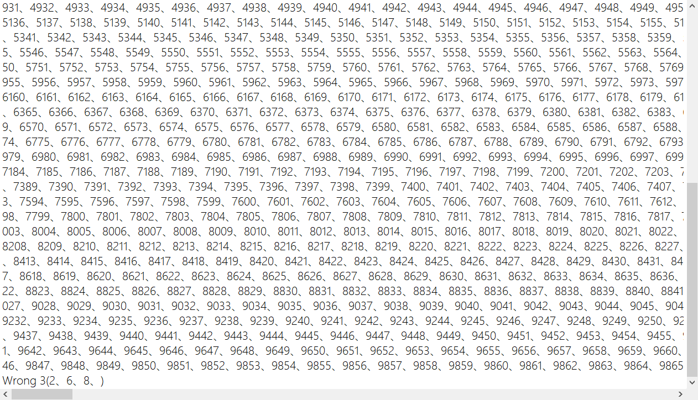

| 这个作业属于哪个课程 | [班级链接](https://edu.cnblogs.com/campus/gdgy/InformationSecurity1912-Softwareengineering) |
| :------------------: | :----------------------------------------------------------: |
|  这个作业要求在哪里  | [作业链接](https://edu.cnblogs.com/campus/gdgy/InformationSecurity1912-Softwareengineering/homework/12147) |
|    这个作业的目标    |               四则运算生成器+生成应用程序+结对               |
|      项目成员1       | 3119005457 郭炜彬 [Github地址](https://github.com/Beam-boop/ArithmeticByGroup/tree/master/ArithmeticByGroup) |
|      项目成员2       |                                                              |
|      项目成员3       | 3119005468 刘霖笙 [Github地址](https://github.com/LiuZhuJunYa/LiuZhuJunYa/tree/master/ArithmeticByGroup) |

**本次作业，经过软工老师同意，我们项目是三人组队完成的。**

# 1 代码链接(Java)

### **1.1 [Github链接](https://github.com/Beam-boop/ArithmeticByGroup/tree/master/ArithmeticByGroup)**

###  **1.2** 可运行的.exe应用程序(Myapp.exe(有图形界面))已经发布至仓库的release包内

# 2 效能分析

- 全部性能


- 类的占用情况



- cpu view



在这个过程中，我们发现生成表达式的类的性能不高，于是我们将原来的算法生成表达式的部分做了改进，**利用树的思想**，具体的代码和解释在下面会详细讲到，提高了算法的性能；并且在过程中还发现了原来算法的bug，会生成超过三个的表达式，可以说这个算法的改进，**既提高了性能，又修改了bug，一举两得！**

# 3 设计实现过程

## 3.1 主要的包

- MyApplication包：三个主程序，Main是生成表达式并且计算结果、MainGrade是计算grade、MainGUI是图形界面的生成表达式并且计算结果

- Util包：项目的最重要部分，分为8个类，下面会详细讲到

## 3.2 主要的类

- GenerateUtil类：生成表达式的类，形如“2/5 + 2'1/3 - 1'1/3 =”

- ReversePolishUtil类：生成逆波兰表达式，以便于进行计算

- CalculateUtil类：利用栈进行计算，先反转栈，进行计算

- FractionUtil类：设计分数的+-*/运算

- FormatUtil类：对结果进行格式化，化简结果，并且进行判断，不能为负

- ExamineUtil类：对结果进行比较，得出grade

- FileIOUt il类：将表达式和结果输出指定文件路径

- 类之间的关系图

  

## 3.3 关键函数

- createExpression()函数，流程图如下

  

- doCalculation()函数，流程图如下

  

# 4 代码说明

- createExpression()函数，该类生成表达式比较复杂，下面代码有详细注释，且上面的流程图很好地解释算法的精髓，部分代码如下

```java
public static String[] createExpression(int range, int num) {
        //避免重复
        HashSet<String> strHashSet = new HashSet<>();

        String operator = "+-×÷";//定义四则运算符号，+-*/
        Vector<String> expression = new Vector<>();//表达式
        Vector<String> result = new Vector<>();

        for (int i = 0; i < num; i++) {
            try {
                //先进行一次一元运算式生成
                int opNum = getRandomNum(1,3);
                char op1 = operator.charAt(getRandomNum(0, 3));
                char op2 = operator.charAt(getRandomNum(0, 3));

                String left;
                String right;

                String valueNow;

                left = fraction(range);
//                left = String.valueOf(getRandomNum(0,1));

                right = fraction(range);
//                right = String.valueOf(getRandomNum(0,1));

                StringBuilder res = new StringBuilder("( " + left + " " + op1 + " " + right + " )");
                valueNow = ReversePolishUtil.ReversePolishNotation(res.toString());
                if (op1 == '-' && valueNow.contains("-")) { //交换左右
                    valueNow = valueNow.substring(1);
                    res = new StringBuilder("( " + right + " " + op1 + " " + left + " )");
                } else if ("+×".contains(String.valueOf(op1)) && //去重
                        !ReversePolishUtil.ReversePolishNotation(
                                "( " + left + " - " + right + " )").contains("-")) {
                    res = new StringBuilder("( " + right + " " + op1 + " " + left + " )");
                }

                for (int j = 0; j < opNum-1; j++) {
                    if (getRandomNum(0, 1) == 0) {
                        left = fraction(range);
//                        left = String.valueOf(getRandomNum(0,1));
                        right = res.toString();

                        if ("×÷".contains(String.valueOf(op1)) && "+-".contains(String.valueOf(op2))) { //若原符号是乘除，新符号是加减，不需要括号 如5+(3*4)应去掉括号
                            res = new StringBuilder("( " + left + " " + op2 + " " + right.substring(1, res.length() - 1) + " )");
                        } else
                            res = new StringBuilder("( " + left + " " + op2 + " " + right + " )"); //其他情况需要括号

                    } else {
                        left = res.toString();
                        right = fraction(range);
//                        right = String.valueOf(getRandomNum(0,1));

                        //判断同级
                        if (("+-".contains(String.valueOf(op1)) && "+-".contains(String.valueOf(op2))) || //若新符号与原符号同级，去掉括号如 (1+2) - 3 应去掉括号
                                "×÷".contains(String.valueOf(op1))) { //若原符号是乘除，不需要括号，如 (2*2)+1 应去掉括号
                            res = new StringBuilder("( " + left.substring(1, res.length() - 1) + " " + op2 + " " + right + " )");
                        } else {
                            res = new StringBuilder("( " + left + " " + op2 + " " + right + " )");
                        }
                    }

                    valueNow = ReversePolishUtil.ReversePolishNotation(res.toString());
                    if (op2 == '-' && valueNow.contains("-")) { //交换左右
                        valueNow = valueNow.substring(1);
                        res = new StringBuilder("( " + right + " " + op2 + " " + left + " )");
                    } else if ("+×".contains(String.valueOf(op2)) && //去重
                            !ReversePolishUtil.ReversePolishNotation(
                                    "( " + left + " - " + right + " )").contains("-")) {
                        res = new StringBuilder("( " + right + " " + op2 + " " + left + " )");
                    }
                    op1 = op2;
                    op2 = operator.charAt(getRandomNum(0, 3));
                }

                valueNow = FormatUtil.finalResult(valueNow);
                String str = res.substring(1, res.toString().length()-1);
```

- ReversePolishNotation()函数，用Stack1栈来存储逆波兰表达式，也称作后缀表达式。

  例如：这个**a*(b-c*d)+e**式子来说，转成波兰表达式后应该是这样子的：**abcd*-*e+**

  

  代码如下

  ```java
  Stack<Character> operators = new Stack<>(); //运算符
  Stack<String> output = new Stack(); //输出结果
  String[] strings = str.split(" ");
  
  int pre = 0;
  boolean digital; //是否为数字（只要不是运算符，都是数字），用于截取字符串
  int len = strings.length;
  int bracket = 0; // 左括号的数量
  
  for (int i = 0; i < len; ) {
      pre = i;
      digital = false;
      //截取数字
      while (i < len && !Operator.isOperator(strings[i])) {
          i++;
          digital = true;
      }
  
      if (digital) {
          output.push(strings[i-1]);
      } else {
          String o = strings[i++]; //运算符
          if (o.equals("(")) {
              bracket++;
          }
          if (bracket > 0) {
              if (o.equals(")")) {
                  while (!operators.empty()) {
                      char top = operators.pop();
                      if (top == '(') {
                          break;
                      }
                      output.push(String.valueOf(top));
                  }
                  bracket--;
              } else {
                  //如果栈顶为 ( ，则直接添加，不顾其优先级
                  //如果之前有 ( ，但是 ( 不在栈顶，则需判断其优先级，如果优先级比栈顶的低，则依次出栈
                  while (!operators.empty() && operators.peek() != '(' && Operator.cmp(o, String.valueOf(operators.peek())) <= 0) {
                      output.push(String.valueOf(operators.pop()));
                  }
                  operators.push(o.charAt(0));
              }
          } else {
              while (!operators.empty() && Operator.cmp(o, String.valueOf(operators.peek())) <= 0) {
                  output.push(String.valueOf(operators.pop()));
              }
              operators.push(o.charAt(0));
          }
      }
  
  }
  ```

- doCalculation()函数，运用两个栈，反转逆波兰表达式的栈Stack1，得到Stack2，pop()出栈顶元素，如果是运算符，就去前numList中前两个元素通过FractionUtil.result函数进行计算，如果不是，则添加进去numList中。

  代码如下

  ```java
  List<String> numList = new ArrayList<>();
  Stack<String> Stack2 = new Stack();
  String operator = "";
  String num1 = "";
  String num2 = "";
  String temp = "";
  //将stack1放入stack2
  for (int i = 0; i < Stack1.size();) {
      Stack2.push(Stack1.pop());
  }
  
  for (int i = 0; i < Stack2.size();) {
      temp = Stack2.pop();
      //判断是否运算符
      if(!Operator.isOperator(temp)){
          numList.add(temp);
      }else{
          operator = temp;
          num1 = numList.get(numList.size() - 2);
          num2 = numList.get(numList.size() - 1);
          numList.remove(numList.size() - 2);
          numList.remove(numList.size() - 1);
          String result = FractionUtil.result(operator,num1,num2);
          if(result.contains("-")){
              throw new Exception();
          }else{
              Stack2.push(result);
          }
      }
  }
  return temp;
  ```

# 5 测试运行

1. 要求1、2：使用 -n 参数控制生成题目的个数，使用 -r 参数控制题目中数值

  - 命令行

  **生成的文件在application目录下的exercises.txt和answers.txt文件中**

  - 界面

  - 

    

  生成文件在

  

  内容为

  

2. 要求3：生成的题目中计算过程不能产生负数，代码如下

  ```java
  String result = FractionUtil.result(operator,num1,num2);
  if(result.contains("-")){
      throw new Exception();
  }else{
      Stack2.push(result);
  }
  ```

  ​	单元测试

  ```java
  //测试结果为负
  @Test
  public void testAnsNeg(){
      String str = "3 - 4";
      try {
          ReversePolishUtil.ReversePolishNotation(str);
      } catch (Exception e) {
          e.printStackTrace();
          System.out.println("测试结果为负，不符合要求！");
      }
  }
  ```


- 要求4：生成的题目中如果存在形如e1÷ e2的子表达式，那么***\*其结果应是真分数\****

  代码中我们都是用真分数进行计算的

  

- 要求5：每道题目中出现的运算符个数不超过3个

  从Exercises.txt文件中可以看出，当生成10000个表达式时，不会超过三个运算符以上的表达式

  从代码中，我们是按照随机数生成确定运算符的个数，在generateUtil类中，**定义int opNum = getRandomNum(1,3);**，可以看出，不会超过三个运算符

- 要求6：不会产生重复的表达式

  从代码的角度可以看出，我们运用二叉树的构造思想，从左右进行插入，将结果是小的放在左边，结果大的放在右边，保证输出只能有一种情况，来满足题目的要求。

  从结果的角度，我们应用0,1和四则运算符进行测试，一共会生成11种不重复的表达式，程序代码及运行的结果如下：

  ```java
  public static void main(String[] args) throws Exception {
      String[] strings = GenerateUtil.createExpression(10,11);
      for (int i = 0; i < strings.length; i++) {
          System.out.println(i+1 + " 、 " +strings[i]);
      }
  }
  ```

  结果：

  

  如果num范围大于11，就会陷入死循环，这是因为我们hashset来存储不重复的数据，代码如下：

  ```java
  //如果生成的表达式没有在hashset中，就说明没有重复
  if (!strHashSet.contains(str)) {
      strHashSet.add(str);
      result.add(valueNow);
      expression.add(str + " = " + valueNow);
  } else i--;
  ```

- 要求7：生成的题目存入执行程序的当前目录下的Exercises.txt文件，在生成题目的同时，计算出所有题目的答案，并存入执行程序的当前目录下的Answers.txt文件

  将exercises.txt和answers.txt存储在src目录下，格式满足要求

  

- 要求8：程序应能支持一万道题目的生成，满足。

- 要求9：程序支持对给定的题目文件和答案文件，判定答案中的对错并进行数量统计

  

  

  生成Grade.txt文本，并且没有错误日志，说明运行没有错误，结果如下图所示，结果没问题，是正确的！

  

# 6 PSP表格

| PSP2.1                                  | Personal Software Process Stages        | 预估耗时 | 实际耗时（分钟） |
| --------------------------------------- | --------------------------------------- | -------- | ---------------- |
| ·Planning                               | · 计划                                  | 45       | 45               |
| · Estimate                              | · 估计这个任务需要多少时间              | 45       | 45               |
| ·Development                            | 开发                                    | 350      | 820              |
| · Analysis                              | · 需求分析 (包括学习新技术)             | 20       | 90               |
| · Design Spec                           | · 生成设计文档                          | 30       | 50               |
| · Design Review                         | · 设计复审                              | 15       | 20               |
| · Coding Standard                       | · 代码规范 (为目前的开发制定合适的规范) | 10       | 20               |
| · Design                                | · 具体设计                              | 50       | 60               |
| · Coding                                | · 具体编码                              | 150      | 500              |
| · Code Review                           | · 代码复审                              | 20       | 20               |
| · Test                                  | · 测试（自我测试，修改代码，提交修改）  | 45       | 60               |
| · Reporting                             | · 报告                                  | 85       | 95               |
| · Test Repor                            | · 测试报告                              | 20       | 20               |
| · Size Measurement                      | · 计算工作量                            | 15       | 15               |
| · Postmortem & Process Improvement Plan | · 事后总结, 并提出过程改进计划          | 50       | 60               |
|                                         | · 合计                                  | 475      | 960              |

# 7 单元测试

本次单元测试设置了十个单元测试用例，具体设置如下：

计算测试

+ 输入带括号加法，检测结果

+ 输入带括号减法，检测结果

+ 输入带括号乘法，检测结果

+ 输入带括号除法，检测结果

+ 输入复杂的四则运算，检测结果

+ 输入带分数的运算，检测结果

特殊情况测试

+ 测试除数为0的情况
+ 测试结果为负的情况
+ 测试分数的约分功能

功能测试

+ 测试能否正确判断答案对错
+ 测试能否真正生成四则运算题目

测试结果如下：

计算测试用例


特殊情况测试：


功能测试：


可以得到11个测试用例全部通过：


# 8 代码审查


代码审查后发现很多错误，都是命名不规范，修改后剩下一些大错误，但是是在jre里面的，所以不给予修改。

# 9 项目小结

成员1：郭炜彬小结

本次项目是由三个人完成的，个人认为试一次成功的结对作业，学习到了很多东西。

1.有学习了新的技能，打包成jar包后，生成exe应用程序

2.在队友的指导下，学会用图形界面做简单界面，后面还需要继续努力学习

3.最重要的还是和队友的合作，说句实话，结对作业比个人作业难，在我个人看来，难不是难在题目的难度，因为很多都可以在网上找得到代码(不过我们的代码大部分是自己写的，少部分借鉴别人)，难在和队友的合作上，因为都是第一次合作，没有经验，不知道从何下手，所以我们就先去借鉴别人的代码，学习别人的思路，收集资料，然后再进行分工合作；在合作中，发现我们对于类和方法的命名习惯不一样，以至于每一次将自己的代码给到别人，需要去更改命名，就有点......，最后我们一起在同一台电脑上进行操作，将自己的思想进行充分的交流，最后才能完成这份看似容易，实则不易的项目作业，也想对组内的成员说声辛苦啦！！！

成员2：刘健君小结

在这次结队项目中，我体会到了合作的重要性。不同于单枪匹马，我们需要将任务及要实现的需求分为几个部分，由每个人完成各自的部分，这也需要我们更加注意代码的规范性。在实现各种功能的过程中，我也学习到了，注意到了以前没有注意到的细节。总的来说，这一次结对作业是一次特别的体验，从中我也学习到了很多，也想对组内的成员说一声辛苦了~~

成员3：刘霖笙小结

首先我十分感谢我的两位队友在这次项目中对我的帮助，由于我本人使用的编程语言限制原因，无法和许多同学进行合作，但是我的两位队友不嫌弃我，与我结对。而我本人在本次项目中的能力也十分有限，只能对思路、资料进行一个整理，在git管理使用上的有限帮助，但是还是学到了很多东西。